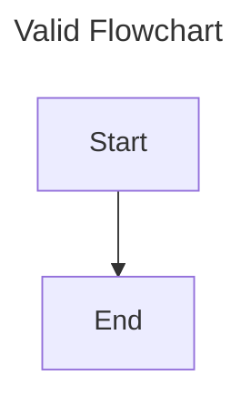

# Test Specification: vsc-md-wysiwyg

## 概要

- **対象:** VS Code 拡張 vsc-md-editor の MVP 機能（Custom Editor、三点モード Preview/Markdown/Raw、WYSIWYG、**GFM 書式ツールバー**、表、Readonly、Mermaid、Marp、画像 paste、シリアライズ、セキュリティ、ログ・共存）
- **対応仕様:** [doc/systemspec.md](systemspec.md) §1–§10（AD-016 三点モード、§2/§8/§9 GFM 書式ツールバー、§1/§5/§6/§7/§9 `preview-rich-embed`、`§1 Preview 可読性 / §5 Mermaid frontmatter・テーマ` `preview-mode-quality` 含む）
- **テストコード:** `src/test/suite/unit/**/*.test.ts`（mocha + vscode mock）、`src/test/suite/integration/**/*.test.ts`（@vscode/test-electron）
- **作成日:** 2026-08-29

## Spec Digest

### Inputs & Types

| 引数 / 入力 | 型 | 最小 | 最大 | 備考 |
|------------|-----|------|------|------|
| `documentUri` | `vscode.Uri` | — | — | ワークスペース内 `.md` |
| `fileContent` | `string` (UTF-8) | 0 B | 推奨 500 KB 未満 | 超過時警告のみ（RK-004） |
| `editorMode` | `"preview" \| "markdown" \| "raw"` | — | — | 初期値 `"markdown"`（AD-016） |
| `modeSwitchCommand` | コマンド / UI 切替 | — | — | モード変更のみ。ディスク I/O なし |
| `rawSourceEdit` | `string` | — | — | Raw 面からのソース。パース成功時のみ Document 反映 |
| `isRawParseFailed` | `boolean` | — | — | true の間は save 拒否（§1, §8） |
| `editOperation` | 編集コマンド / キー入力 | — | — | RO 時拒否；Preview 面からは送らない |
| `formatToolbarCommand` | `data-cmd` 列挙 | — | — | `strike` / `inlineCode` / `heading`+`data-level` 1–6 / `taskList` / `blockquote` / `horizontalRule` 等（§2）。第一操作はツールバー |
| GFM strikethrough 入力 | `~~text~~` または `<del>` / `<s>` | — | — | 出力は常に `~~text~~`（§8） |
| GFM task list 入力 | `- [ ]` / `- [x]` / `- [X]` / `1. [ ]` | — | — | 出力 `- [ ]` / `- [x]`（小文字 `x`）。`1. [ ]` は unordered へ正規化 |
| `tableFormat` | `'gfm' \| 'html'` | — | — | 表ごとの永続化形式（§3, AD-005） |
| `insertTableFormat` | `'gfm' \| 'html'` | — | — | セッション挿入デフォルト。再起動で `gfm` にリセット |
| `tableOperation` | 列挙 | — | — | `insert`、行/列追加・削除、`convertToGfm` / `convertToHtml`、`setInsertDefault` |
| 表サイズ | 行 × 列 | 1×1 | ソフト上限 100行×20列 | 超過時 UI 警告、保存は許可 |
| `toggleReadonlyCommand` | コマンド | — | — | `Toggle Readonly Mode`（三点 Preview とは別） |
| `mermaidSource` | `string` | 0 文字 | — | debounce 300 ms 目安 |
| `documentContent` | `string` | — | — | Marp front matter + 本文 |
| `clipboardImage` | `image/*` バイナリ | 1 B | — | jpg/png/gif/svg |
| `sequenceNumber` | 整数 | 1 | 9999 | `image-NNNN` ゼロ埋め |
| `untrustedHtml` | `string` | — | — | 外部 `.md` 取込 |
| `imageSrc` | `string` | — | — | Document / `docJson` 内相対パス（例: `img/image-0001.png`）。Host が表示投影時に rewrite |
| `isMarpDocument` | `(markdown: string) => boolean` | — | — | 共有ユーティリティ。Preview 切入・`markdownText` 更新で再評価 |
| `previewMarpHtml` | `{ html: string }` | — | — | Host → Webview。サニタイズ済み Marp body 断片 |
| `themeUpdated` | `{ kind: 'light' \| 'dark' \| 'highContrast' }` | — | — | Host → Webview。`onDidChangeActiveColorTheme` および init/ready 時（§1 / AD-010） |
| `mermaidSource` (frontmatter) | `string` | — | — | フェンス内全文（YAML frontmatter / `%%{init:...}%%` 含む。Webview strip 禁止 — §5 AD-003） |

### Outputs & Failure Returns

| 条件 | 戻り値 / ステータス | 仕様根拠 |
|------|-------------------|---------|
| Custom Editor オープン成功 | タブ表示、Webview ロード完了、初期モード Markdown、viewType `vsc-md-editor.wysiwyg` | §1, AD-002, AD-016 |
| モード切替成功 | 対象面表示、Document 維持、ディスク未書込、内容不変なら dirty 不変 | §1 |
| 保存成功 | ディスク `.md` 更新、`dirty` 解除 | §1, §8 |
| シリアライズ失敗 | 保存拒否、`dirty` 維持、通知 + Output | §1, §8 |
| Raw パース失敗 | Document 非更新、通知 + Output、save ブロック | §1 例外系 2, §8 |
| Raw パース回復 | `isRawParseFailed=false`、save 再開可 | §1, §8 |
| RO ON | Markdown / Raw 全編集面ロック、バッジ表示（三点 Preview とは別） | §4, AD-006 |
| 表ソフト上限超過 | UI 警告表示、保存は許可 | §3（Advisor default） |
| 表挿入（`gfm`） | 表 UI 更新、保存時 GFM パイプ表出力 | §3, AD-005 |
| 表挿入（`html`） | 表 UI 更新、保存時 HTML `<table>` 出力 | §3, AD-005, AD-010 |
| `convertToHtml` 成功 | 当該表 `tableFormat: 'html'`、確認なし即時 | §3 Outputs |
| `convertToGfm` 成功 | 当該表 `tableFormat: 'gfm'`、リッチ内容 flatten | §3 Outputs |
| `convertToGfm` キャンセル | 変換なし、`tableFormat` 不変 | §3 Outputs |
| `setInsertDefault` 成功 | `insertTableFormat` 更新、Table ボタン色反映。既存表不変 | §3, AD-004 |
| GFM 表セル編集 | `tableFormat` 維持（自動 HTML 変換なし） | §3 廃止挙動 |
| 非 Marp 文書プレビュー | 「No Marp slides detected」ガイダンス | §6（Advisor default） |
| 未保存新規 `.md` への画像 paste | paste 拒否、「Save document first」通知 | §7（Advisor default） |
| RO（未保存 WS） | セッション内のみ有効 | §4（Advisor default） |
| Mermaid 構文エラー | ブロック内エラー表示、ソース保持 | §5 |
| 画像 paste 成功 | `img/image-NNNN.ext` 保存 + 参照挿入 | §7 |
| XSS 要素 | サニタイズ除去 | §9 |
| 書式適用成功（Markdown・非 RO） | UI 更新、Document dirty、Raw 投影 | §2 Outputs |
| RO 中の新書式ボタン / タスク checkbox | 操作無効（`pointer-events: none` + ハンドラガード）。checkbox トグル不可 | §2, §4 |
| Preview 中の書式ツールバー | 非表示。編集イベントを Document へ送らない | §2, §1 |
| Raw 中の書式コマンド | ツールバー表示は維持、コマンドは no-op | §2 |
| strike シリアライズ | 常に GFM `~~text~~`（`<del>` / `<s>` は出さない） | §8 |
| sanitize `del` / `s` | 許可。`mark`（下線・highlight）は許可追加しない | §9 |
| 画像表示投影成功 | TipTap `image.src` / Marp HTML `` が webview URI | Host `asWebviewUri` rewrite。Document / serialize は相対パス維持 | §7, §9 |
| 画像 URI 解決不可 | broken image + Output debug ログ（通知なし） | `img/` 外・`..` 含む・ワークスペース外は rewrite しない | §7, §9 |
| Preview 内 Marp 描画成功 | `#preview-marp-root` にスライド HTML RO 表示、`#editor` 非表示 | `previewMarpHtml` postMessage。入力は `markdownText` | §1, §6 |
| Preview Mermaid 表示 | `.mermaid-preview` のみ表示、`.mermaid-source` 非表示 | `body[data-mode="preview"]` CSS | §5 |
| Mermaid frontmatter 全文 render | YAML frontmatter 含むソースで SVG 表示。`mermaid.render` に全文渡し | Document / serialize はフェンス全文維持 | §5 正常系 6, AD-003 |
| `themeUpdated` 受信 | `mermaid.initialize` 更新 + 表示中 NodeView 再 render（debounce） | payload は `kind` 列挙のみ | §1 postMessage, §5 正常系 8, AD-005 |
| Preview 可読性 CSS | `body[data-mode='preview']` スコープで `line-height: 1.6`、`.ProseMirror[contenteditable='false']` の `opacity: 1` | Markdown / Raw スタイル不変、`--vscode-*` トークン使用 | §1 Preview 可読性, AD-006 |

### Preconditions & Assumptions

- VS Code `engines.vscode` 最小バージョンを満たす（AD-001）
- 対象 URI はファイルシステム上の通常ファイル
- Webview でスクリプト有効化が許可される
- 画像 paste は対象 `.md` がディスク上の保存済みパスを持つこと（§7）
- RO 永続化は保存済みワークスペースの `workspaceState` のみ（§4）
- 統合テストは Extension Development Host 上で実行（AD-012）

### Complexity Budget

- 表ソフト上限: 100行×20列 — UI 警告閾値。P2 で 101行・21列の警告検証
- 大ファイル: 500 KB 超 — Output 警告、編集継続
- Mermaid debounce: 300 ms — 連続入力で過剰再描画しないこと
- 画像連番: 最大 9999 — 4 桁ゼロ埋め

### Spec Gaps

- （なし — Advisor defaults および AD-016 三点モード契約は systemspec に反映済み。詳細は [systemspec.md Spec Gaps（resolved）](systemspec.md#spec-gapsresolved)）
- 番号付きタスク `1. [ ]` の unordered 正規化・複合 mark のネスト順入れ替わりは仕様上の許容（§2 / §8）。本 testspec では意味保持を検証し byte 一致は要求しない
- **実装ギャップ（Red テスト済み）:** TC-016–019, TC-054, TC-086–087, TC-091–092 ユニット（`table-gfm-html-mode`）。TC-085, TC-089–090, TC-093–096 は未実装
- **実装ギャップ（Red テスト済み）:** TC-107–123 ユニット（`gfm-format-toolbar`）。build-agent 向け TDD Red
- **`preview-rich-embed`:** TC-124–142 ユニット Green（`preview-rich-embed.test.ts`、91 passing）

---

## Test Matrix

| ID | Category | Domain Tag | Priority | Input | Expected | Rationale | Spec Ref |
|----|----------|------------|----------|-------|----------|-----------|----------|
| TC-001 | Happy | custom-editor-open | P0 | ワークスペース内 `sample.md`（見出し+段落）を Custom Editor で開く | WYSIWYG タブ表示、見出し・段落がレンダリングされる | MVP 基本フローの起点 | §1 正常系 1 |
| TC-002 | Happy | dirty-state | P0 | TC-001 状態で段落に文字を追加 | Document が `dirty`、タブに未保存インジケータ | 編集→dirty 連動 | §1 正常系 2 |
| TC-003 | Happy | save | P0 | TC-002 状態で `save` 実行 | ディスク上 `.md` が更新、`dirty` 解除、AD-013 整形適用 | 保存パイプラインの正常系 | §1 正常系 3, §8 正常系 2 |
| TC-004 | Happy | undo-redo | P0 | TC-002 状態で `undo` → `redo` | 編集が取り消され再適用される | Document 経由 undo/redo | §1 正常系 4 |
| TC-005 | Corner | unsaved-close | P1 | 未保存変更ありでエディタを閉じる | VS Code 標準の保存確認ダイアログ | データ損失防止 | §1 正常系 5 |
| TC-006 | Corner | parse-failure-save | P1 | シリアライズ不能な内部構造を生成し `save` | 保存拒否、`dirty` 維持、通知 + Output 記録 | 破損ファイル書込防止 | §1 例外系 1, §8 例外系 1 |
| TC-007 | Corner | external-file-change | P1 | エディタ開放中に外部プロセスが同一 `.md` を変更 | VS Code 標準リロード/競合フロー | 外部同期 | §1 例外系 2 |
| TC-008 | Boundary | large-file | P1 | 500 KB 超の `.md` を開く | 編集継続可、Output に大ファイル警告 | RK-004 警告のみ | §1 Outputs |
| TC-009 | Corner | file-read-failure | P1 | 存在しない/権限なし URI で開く試行 | エディタ未表示、通知 + Output | FS エラー処理 | §1 Outputs |
| TC-010 | Happy | wysiwyg-format | P0 | 選択テキストに太字をツールバー適用。ツールバー In は Strike / H3–H6 / Inline Code / Task / Quote / HR を含む（詳細 TC-107–113） | UI に `<strong>` 相当表示、dirty。新 In コマンドも Markdown かつ非 RO で UI 更新 + dirty | WYSIWYG 書式（GFM ツールバー含む） | §2 正常系 1 |
| TC-011 | Happy | realtime-model | P0 | キー入力で段落を編集 | 内部モデル即時更新、UI 反映 | リアルタイム編集 | §2 正常系 2 |
| TC-012 | Happy | wysiwyg-serialize | P0 | 見出し（h1–h6）・リスト・リンク・取り消し線（`~~`）・インラインコード・引用（非 paragraph 子含む）・タスクリスト（`- [ ]`/`- [x]`）・水平線（`---`）を含む doc を save | remark パイプラインで Markdown（+許可 HTML）出力。上記 GFM ノードが保持される（往復詳細は TC-107–113） | シリアライズ連携（§2 In ノード含む） | §2 正常系 3, §8 正常系 8 |
| TC-013 | Happy | theme-integration | P1 | VS Code テーマ切替（dark/light/highContrast）および Webview init/ready | Webview が `var(--vscode-*)` で見た目更新。Host が `themeUpdated: { kind }` を送信（payload は列挙型のみ — §1 / AD-010）。Mermaid 再描画は TC-145 | テーマ統合 + themeUpdated 契約 | §1 postMessage, §2 正常系 4, §5 |
| TC-014 | Structural | unsupported-syntax | P1 | 脚注（`[^1]`）・GitHub Alerts（`> [!NOTE]`）等 **Out** 記法を含む `.md` を開く | 可能な限り原文保持、読取表示。footnotes / Alerts は GFM 拡張として有効化しない。`~~` と `- [ ]` は **In**（本 TC 対象外 — TC-107, TC-111） | データ損失回避。脚注は引き続き Out | §2 例外系 1, Non-Goals, §8 正常系 10 |
| TC-015 | Corner | serialize-block | P1 | シリアライズ不能構造（schema 外ノード）で save | 保存ブロック、エラー表示（AD-015） | 保存安全 | §2 例外系 2 |
| TC-016 | Happy | table-insert-gfm | P0 | 既定 `insertTableFormat='gfm'` で Insert table（3×3・ヘッダ行）→ セルにテキスト入力 → save | 表 UI 表示、`tableFormat:'gfm'`、`.md` に GFM パイプ表出力、dirty→save 成功 | デフォルト GFM 挿入 | §3 正常系 1, 4, AD-005 |
| TC-017 | Happy | table-rich-cell-html | P0 | `tableFormat:'html'` の表でセル内に改行・箇条書き・チェックボックスを入力 → save | WYSIWYG でリッチ表示、保存時 HTML `<table>` に `<br/>` / `<ul>` / checkbox 相当が含まれる | HTML モードリッチセル | §3 正常系 2, AD-008 |
| TC-018 | Happy | table-html-insert-save | P0 | `insertTableFormat='html'` で Insert table → セル編集 → save | `tableFormat:'html'`、`.md` に HTML `<table>` ブロック出力 | HTML 挿入永続化 | §3, AD-005 |
| TC-019 | Happy | gfm-no-auto-convert | P0 | GFM パイプ表のみの `.md` を開き、任意セルを編集 → save | `tableFormat` は `'gfm'` のまま。自動 HTML 変換なし。保存出力は GFM パイプ表 | 初回編集時自動変換廃止 | §3 廃止挙動, 正常系 5 |
| TC-020 | Corner | table-sanitize-load | P1 | `<script>` 含む外部 HTML 表を含む `.md` を開く | 危険要素除去後に表表示 | RK-003 | §3 例外系 1 |
| TC-021 | Boundary | table-soft-limit-ok | P1 | 100行×20列の表（境界値） | 警告なし、編集・保存可 | ソフト上限境界（ inclusive ） | §3 Inputs |
| TC-022 | Boundary | table-rows-exceed | P1 | 101行目を追加 | UI 警告表示、保存は成功 | 行超過警告 | §3 Behavior |
| TC-023 | Boundary | table-cols-exceed | P1 | 21列目を追加 | UI 警告表示、保存は成功 | 列超過警告 | §3 Behavior |
| TC-024 | Corner | table-readonly | P1 | RO ON 状態で Table メニュー全項目（Insert、行/列操作、Convert、New tables default）を試行 | 全項目無効（`aria-disabled` または disabled）、UI フィードバック | RO 連動 | §3 例外系 3, §5 |
| TC-025 | Happy | readonly-on | P0 | `Toggle Readonly Mode` 実行（編集可能 doc） | 編集不可、`editable: false`、RO バッジ | RO 有効化 | §4 正常系 1 |
| TC-026 | Happy | readonly-off | P0 | RO ON 状態で再度トグル | 編集可、バッジ解除 | RO 解除 | §4 正常系 1 |
| TC-027 | Happy | readonly-persist | P0 | 保存済み WS で RO ON → エディタ閉じる → 再オープン | RO 状態復元 | workspaceState 永続化 | §4 正常系 2, 5 |
| TC-028 | Happy | readonly-key | P1 | `readonly:<uri>` キーで workspaceState を直接確認 | トグル後に `true`/`false` が記録 | 永続化キー検証 | §4 Inputs |
| TC-029 | Happy | readonly-view-only | P1 | RO ON で Mermaid ブロック・Marp プレビューを表示 | 描画/プレビューは利用可、編集不可 | 閲覧系は RO 中も可 | §4 正常系 4 |
| TC-030 | Corner | readonly-unsaved-ws | P1 | 未保存 WS で RO ON → VS Code 再起動 → 同一 `.md` を開く | 再起動前は RO 有効、再起動後は RO 解除（非永続） | 未保存 WS スコープ | §4 例外系 1 |
| TC-031 | Happy | mermaid-render | P0 | ` ```mermaid ` ブロック（`graph TD; A-->B`）を含む doc | ブロック内に SVG/図表示 | Mermaid 基本描画 | §5 正常系 1 |
| TC-032 | Happy | mermaid-debounce | P1 | Mermaid ソースを連続入力（300 ms 以内） | debounce 後に 1 回再描画 | 過剰描画抑制 | §5 Inputs |
| TC-033 | Happy | mermaid-save | P0 | TC-031 状態で save | `.md` に ` ```mermaid ` フェンスとして残る | ソース永続化 | §5 正常系 2 |
| TC-034 | Corner | mermaid-syntax-error | P1 | 不正 Mermaid 構文を入力 | ブロック内エラー表示、ソース保持、Output 記録 | 構文エラー処理 | §5 Outputs |
| TC-035 | Corner | mermaid-readonly | P1 | RO ON で Mermaid ソース編集試行 | 編集拒否（描画は表示維持） | RO 連動 | §5 正常系 3 |
| TC-036 | Corner | mermaid-xss | P1 | Mermaid ソースに XSS 試行ペイロード | サニタイズ、スクリプト実行なし | RK-003 | §5 例外系 1 |
| TC-037 | Corner | mermaid-timeout | P1 | 描画タイムアウトを誘発する大きな図 | タイムアウトエラー表示 | RK-004 | §5 Outputs |
| TC-038 | Happy | marp-preview | P0 | Marp front matter + `---` 区切りスライドを含む doc | スライド HTML プレビュー表示 | Marp 基本 | §6 正常系 1 |
| TC-039 | Happy | marp-update | P0 | TC-038 状態で本文スライドを編集 | プレビューが追随更新 | リアルタイム更新 | §6 正常系 2 |
| TC-040 | Happy | marp-readonly | P1 | RO ON で Marp プレビュー表示 | プレビュー表示可 | RO 中閲覧 | §6 正常系 3 |
| TC-041 | Corner | marp-parse-error | P1 | 不正 front matter の doc | プレビュー内エラー、Output 記録、`.md` 不変 | パース失敗 | §6 Outputs, 例外系 1 |
| TC-042 | Corner | marp-non-marp | P1 | 通常 Markdown（Marp front matter なし）でプレビュー起動 | 「No Marp slides detected」ガイダンス表示 | 非 Marp 方針 | §6 Outputs |
| TC-043 | Happy | image-paste | P0 | 保存済み `doc/sample.md` に PNG を paste | `img/image-0001.png` 作成、`` 挿入 | 画像 paste 基本 | §7 正常系 1–4 |
| TC-044 | Happy | image-sequence | P0 | 既存 `img/image-0001.png`, `img/image-0003.png` がある doc に paste | `img/image-0004.png` 採番（最大+1） | 連番採番 | §7 正常系 2 |
| TC-045 | Happy | image-mime-ext | P1 | jpg/png/gif/svg 各 MIME で paste | 拡張子が MIME に対応（`.jpg`/`.png`/`.gif`/`.svg`） | 拡張子決定 | §7 正常系 3 |
| TC-046 | Happy | image-dir-create | P1 | `img/` 不在の `.md` ディレクトリに paste | `img/` 自動作成 + 画像保存 | ディレクトリ作成 | §7 Preconditions |
| TC-047 | Corner | image-readonly | P1 | RO ON で画像 paste | 操作拒否 | RO 連動 | §7 Outputs |
| TC-048 | Corner | image-fs-failure | P1 | 書込不可ディレクトリ（権限 mock）に paste | 通知、挿入なし | FS エラー | §7 Outputs |
| TC-049 | Corner | image-non-image | P1 | テキストのみ clipboard を paste | 通常 paste へ委譲（画像処理なし） | 非画像無視 | §7 Outputs |
| TC-050 | Corner | image-unsaved-doc | P1 | 未保存新規 Untitled `.md` に画像 paste | paste 拒否、「Save document first」通知 | Advisor default | §7 Preconditions, Behavior |
| TC-051 | Corner | image-path-traversal | P1 | 不正 URI 正規化を試みる paste 操作 | ワークスペース外書込なし | パストラバーサル防止 | §7 正常系 5, §9 |
| TC-052 | Happy | serialize-open | P0 | 見出し+HTML表+ Mermaid を含む `.md` を開く | 内部モデルに正しく parse | オープン parse | §8 正常系 1 |
| TC-053 | Happy | serialize-deterministic | P0 | 同一 doc を連続 2 回 save | 2 回目出力が 1 回目と byte-identical（AD-013） | 決定的出力 | §8 正常系 4 |
| TC-054 | Happy | serialize-table-roundtrip | P0 | HTML `<table>` を含む doc を open→save | `<table>` 構造が保持 | round-trip | §8 正常系 3 |
| TC-055 | Structural | serialize-raw-preserve | P1 | 部分パース不能ブロックを含む `.md` | raw 保持優先、可能範囲表示 | データ保全 | §8 例外系 1 |
| TC-056 | Corner | serialize-failure | P1 | stringify 失敗を mock | 保存中断、Output 概要（全文なし） | 失敗通知 | §8 Outputs |
| TC-057 | Happy | security-csp | P0 | Webview HTML を検査 | `default-src 'none'` 基調 CSP、nonce 付き script/style | CSP 設定 | §9 正常系 1 |
| TC-058 | Corner | security-script-strip | P0 | `<script>alert(1)</script><p>ok</p>` を含む doc を表示 | `<script>` 除去、`<p>ok</p>` 表示 | XSS 防御 | §9 正常系 2 |
| TC-059 | Corner | security-on-attr-strip | P1 | `` を含む doc | `on*` 属性除去 | イベント属性拒否 | §9 Outputs |
| TC-060 | Happy | security-local-roots | P1 | Webview `localResourceRoots` を検証；`isSafeImagePath` と `img/` スコープの整合 | 拡張 `media/` と WS `img/` のみ。`isSafeImagePath` は `img/` プレフィックス必須・`..` 禁止と一致。CSP / roots 緩和なし | リソース制限 + 画像 rewrite 回帰 | §9 Preconditions, §7 |
| TC-061 | Corner | security-image-scope | P1 | ワークスペース外パスへの画像保存試行 | 拒否、通知 | 保存先限定 | §9 正常系 3 |
| TC-062 | Happy | output-channel | P1 | シリアライズエラーを発生させる | Output `MD WYSIWYG Editor` に概要記録（全文なし） | ログ可観測性 | §10 正常系 1 |
| TC-063 | Happy | editor-coexistence | P1 | Custom Editor 開放中に `Reopen Editor With…` → Built-in Markdown | ビルトインエディタで開ける | AD-014 共存 | §10 正常系 3 |
| TC-064 | Corner | output-render-failure | P1 | Mermaid/Marp 描画失敗 | Output に記録、インラインエラー優先 | AD-015 | §10, §5, §6 |
| TC-065 | Stress | table-max-soft | P2 | 100×20 表で全セル編集後 save | 5 s 以内に save 完了、警告なし | 上限境界性能 | §3 |
| TC-066 | Stress | large-doc-open | P2 | 450 KB `.md`（Mermaid 10 ブロック）を open | 30 s 以内に Webview ロード | 大 doc 性能 | §1, RK-004 |
| TC-067 | Corner | regression-edit-display-break | P0 | Webview 起点の `updateFromJson(..., { syncWebview: false })` | `onDidContentChange` は発火しない（echo 抑止）。`onDidChange` は発火（dirty 維持） | Regression: 編集後に setContent echo で表示破壊 | §1 Behavior 2 |
| TC-068 | Corner | regression-edit-display-break | P0 | 既定の `updateDoc` / undo による Document 変更 | `onDidContentChange` が発火し、docUpdated 用リスナーが通知される | Regression: 外部同期（undo/revert）が途切れないこと | §1 Behavior 4 |
| TC-069 | Corner | regression-edit-display-break | P0 | Mermaid フェンス付き doc で段落テキストのみ変更後 serialize | ` ```mermaid ` フェンスとソースが残る | Regression: 通常編集で Mermaid が消えないこと | §5 正常系 2 |
| TC-070 | Happy | editor-mode-init | P0 | Custom Editor（viewType `vsc-md-editor.wysiwyg`）で `.md` を開く | 初期 `editorMode === "markdown"`、タブ viewType が `vsc-md-editor.wysiwyg` | AD-016 初期モード + AD-002 viewType | §1 Inputs, 正常系 1 |
| TC-071 | Happy | preview-one-way | P0 | Preview モード表示中に描画面からの編集イベントを送ろうとする / Document のみ更新 | Preview は RO 描画のみ。編集イベントは Document へ送られない。Document 更新時は描画が追随 | Document→一方表示契約 | §1 三点モード定義, 正常系 3 |
| TC-072 | Happy | markdown-raw-sync | P0 | Markdown 面で段落編集 → Raw 投影；続けて Raw 相当のソースを Document に反映 | 正本は `MarkdownDocument`。一方の変更が他方面へ Document 経由で反映され、`markdownText` / `doc` が一致 | Markdown↔Raw 相互リアルタイム同期 | §1 正常系 2, §8 |
| TC-073 | Corner | mode-switch-no-io | P0 | dirty=false の Document で Preview↔Markdown↔Raw を切替のみ（内容変更なし） | ディスクへの `writeFile` なし、`onDidChange`（dirty）非発火、Document 内容不変 | モード切替 alone は表示のみ | §1 正常系 4, AD-016 |
| TC-074 | Happy | edit-dirty-save | P0 | Markdown または Raw 相当の内容変更 → `save` / `saveAs` | 変更で dirty（`onDidChange`）、save 後ディスク更新・シリアライズ反映 | 通常編集の dirty/save 契約 | §1 正常系 5, §8 |
| TC-075 | Happy | file-ro-locks-editors | P0 | ファイル RO ON 後に Markdown / Raw 編集を試行 | 両編集面とも編集不可（`editable: false`）。三点 Preview（描画 RO）とは別概念（RO フラグ独立） | AD-006 全編集面ロック | §4 正常系 1, 3 |
| TC-076 | Happy | ro-allows-viewing | P0 | ファイル RO ON のまま三点モード切替・Preview 表示・Marp Preview 起動 | モード切替可、Preview / Marp 閲覧可。編集は不可のまま | RO 中も閲覧系は可 | §4 正常系 4–5, §6 |
| TC-077 | Structural | marp-vs-preview | P0 | 三点 Preview（mode id `preview`）と Marp Preview **パネル**（`vsc-md-editor.marpPreview` / `showMarpPreview`）を比較 | **別 UI インスタンス**・別 viewType/コマンドは維持。三点 Preview は Marp 検出時に同一 Webview 内 `#preview-marp-root` でスライド RO 表示可（非 Marp は TipTap RO）。パネル自動オープンなし | AD-008 責務分離 + Preview 内 Marp 兼用（RK-017） | §1, §6 |
| TC-078 | Corner | raw-parse-fail | P0 | Raw ソースをパース不能な文字列に変更して Document へ適用試行 | Document（直前の有効内容）非破壊、通知 + Output、`isRawParseFailed=true`、`save` ブロック | Raw 失敗時データ保全 | §1 例外系 2, §8 |
| TC-079 | Happy | raw-parse-recover | P0 | TC-078 状態から有効な Raw ソースに修正して再適用 → `save` | `isRawParseFailed=false`、Document 更新、save 成功 | パース回復後の save 再開 | §1, §8 |
| TC-080 | Happy | preview-mode-refresh | P0 | Preview または Markdown へモード切替 | Host が Document 最新を再投影（Raw 離脱 flush 後を含む）。**非 Marp Preview:** rewrite 済み `docJson`。**Marp 検出 Preview:** `previewMarpHtml` で `#preview-marp-root` 更新。表示層のみで Document / serialize 不変 | Preview 厳密 RO・切替時 refresh | §1 三者同期, 正常系 3–4 |
| TC-081 | Happy | raw-mode-text-projection | P0 | Raw へモード切替 | Host が `markdownText` のみ投影（docJson なし）。Marp 分岐・画像 rewrite は Raw 面に適用しない | Raw 面の Document 追随 | §1 三者同期 |
| TC-082 | Happy | triple-sync-document | P0 | Markdown 編集 → Document；続けて Raw 編集 → Document；Preview 投影中に画像 rewrite / Marp HTML / Mermaid CSS が適用 | 正本 `MarkdownDocument` が唯一の真実。`docJson` / `markdownText` は同一 Document から導出。表示層（画像 URI rewrite・`previewMarpHtml`・Mermaid ソース非表示 CSS）は Document / serialize を変更しない | Raw↔Markdown↔Preview 三者同期 + 表示層非変更 | §1 三者同期, AD-008 |
| TC-083 | Happy | builtin-switch-detect | P1 | dispose 後アクティブタブが同一 `.md` の `TabInputText` または非 wysiwyg `TabInputCustom` | `isBuiltinSwitchToSameMdFile` が true。タブ閉鎖・別 URI・wysiwyg タブは false | Pattern A 検知 | §10 正常系 4 |
| TC-084 | Happy | open-with-wysiwyg-cmd | P1 | `activate` 後に `getCommands` | `vsc-md-editor.openWithWysiwyg` が登録。`package.json` に command・configuration・editor/title menu が存在 | Pattern A 復帰コマンド | §10 正常系 5 |
| TC-085 | Happy | table-row-col-ops | P0 | `tableFormat:'gfm'` の表内で Add row above/below、Delete row、Add column left/right、Delete column を順に実行 | 行/列が増減し UI 反映。`tableFormat` 不変。save で GFM パイプ表 | メニュー行/列操作 | §3 正常系 1, Table UI #2 |
| TC-086 | Happy | table-convert-gfm-to-html | P0 | `tableFormat:'gfm'` の表で Convert to HTML table を実行（確認なし） | 即時 `tableFormat:'html'`。save で HTML `<table>` 出力。Undo 1 段で復元可 | GFM→HTML 明示変換 | §3 Outputs, 正常系 6 |
| TC-087 | Happy | table-convert-html-to-gfm | P0 | リッチ内容（改行・リスト・チェックボックス）を含む `tableFormat:'html'` の表で Convert to GFM pipe table → 確認ダイアログで OK | 確認後 `tableFormat:'gfm'`。リスト・チェックボックス等のブロックリッチはプレーンテキストへ flatten。**セル内改行は `<br />`（または同等）として保持**し単一改行へ正規化。save で GFM パイプ表 | **Updated:** flatten はブロックリッチ除去；改行は GFM `<br />` 契約で保持 | §3 Outputs, 正常系 6, AD-006 |
| TC-088 | Corner | table-convert-gfm-cancel | P1 | TC-087 同等の HTML 表で Convert to GFM → 確認ダイアログで Cancel | 変換なし。`tableFormat:'html'` 維持、リッチ内容保持 | 変換キャンセル | §3 Outputs |
| TC-089 | Happy | table-insert-default-toggle | P0 | New tables default: HTML を選択 → Insert table → 既存 GFM 表は不変 | `insertTableFormat:'html'`、Table ボタンがアクセント色（`table-format-html` 等）。新規表は `html`、既存 GFM 表の `tableFormat` 不変 | セッションデフォルト + ボタン色 | §3, AD-004 |
| TC-090 | Happy | table-format-menu-indicator | P1 | カーソルを GFM 表内に置き Table ドロップダウンを開く | 当該表の `tableFormat:'gfm'` にチェックマーク。ボタン色は `insertTableFormat`（セッションデフォルト）を反映し per-table と分離 | per-table vs セッション UI 分離 | §3 Table UI |
| TC-091 | Happy | table-gfm-roundtrip | P0 | GFM パイプ表を含む `.md` を open → セル編集なしで save | 入出力が GFM パイプ表のまま。`tableFormat:'gfm'` 推論。構造 byte-identical（AD-013） | GFM round-trip | §3 正常系 4–5, §8 |
| TC-092 | Happy | table-html-roundtrip | P0 | HTML `<table>` を含む `.md` を open → セル編集なしで save | 入出力が HTML `<table>` のまま。`tableFormat:'html'` 推論。構造保持（TC-054 補完） | HTML round-trip | §3 正常系 4–5, §8 |
| TC-093 | Corner | table-row-col-outside-disabled | P1 | カーソルが表外のとき Table ドロップダウンを開く | 行/列操作・Convert 項目が無効。Insert table と New tables default は有効 | 表外 precondition | §3 Preconditions |
| TC-094 | Corner | table-convert-menu-disabled | P1 | `tableFormat:'gfm'` の表で Convert to GFM を試行；`html` 表で Convert to HTML を試行 | 当該表形式と不一致の Convert 項目は無効 | 変換メニュー条件 | §3 Table UI #3–4 |
| TC-095 | Corner | table-insert-default-reset | P1 | `insertTableFormat:'html'` に設定 → VS Code 再起動 → 同一 doc を開く | `insertTableFormat` は `'gfm'` にリセット。Table ボタンは通常色 | セッション非永続 | §3 Inputs |
| TC-096 | Corner | table-gfm-rich-restricted | P1 | `tableFormat:'gfm'` の表セルにリスト・チェックボックス入力を試行（改行は TC-104 系） | リスト・チェックボックス等のブロックリッチは入力不可または flatten。**単一セル内改行は許可**（`<br />` 永続化・単一改行表示）。連続空行相当は不可 | **Updated:** 改行不可想定を廃止；ブロック構造のみ制限（§3 GFM 改行契約） | §3 正常系 3, AD-008 |
| TC-101 | Happy | table-convert-updates-markdown-text | P0 | HTML 表を含む Document で `updateDoc(convertTableToGfmAtIndex)` | `markdownText` から `<table>` が消え GFM パイプ表になる（Raw 正本） | Host Raw 正本 | §3 正常系 6 |
| TC-102 | Happy | table-convert-via-request-message | P0 | Custom editor 上で `requestConvertToGfm`（tableIndex=HTML 表、確認 OK） | Document `markdownText` から `<table>` が消える | Host ハンドラ経由変換 | §3 正常系 6 |
| TC-103 | Corner | table-convert-stale-update-dropped | P0 | TC-102 の後に変換前の HTML `docJson` を epoch なし/`0` で `update` | `markdownText` は GFM のまま。stale update で HTML に戻らない | 確認ダイアログ中の上書き防止 | §3 正常系 6 |
| TC-104 | Corner | regression-gfm-cell-linebreak-serialize | P0 | `tableFormat:'gfm'` の表セルに複数 paragraph（Enter 改行相当）を持つ Document を serialize | Raw/保存出力の当該パイプセルに `<br />`（または同等 hard break）が含まれ、両行テキストが残る | Regression: MD→Raw でセル内改行が落ちる（`cellToPhrasing`） | §3 Inputs cellContent, 正常系 3–4 |
| TC-105 | Corner | regression-gfm-cell-br-parse | P0 | Raw `| a<br />b |` を含む GFM パイプ表を parse | セルは単一改行として復元。`htmlBlock`（`<br />`）による多重改行にならない。テキスト `a`/`b` を保持 | Regression: Raw→MD で br→htmlBlock の二重改行 | §3 正常系 3, 5 |
| TC-106 | Corner | regression-gfm-cell-br-roundtrip | P0 | `| a<br />b |` を parse → serialize → 再 parse | serialize で `<br />`（または同等）が落ちない。再 parse で余分な改行ノード（htmlBlock / 空段落）が増えない | Regression: GFM セル改行往復不整合 | §3 正常系 3–5 |
| TC-107 | Happy | gfm-strike-roundtrip | P0 | `~~hello~~` を parse → serialize。モデル上 strike mark からも serialize | parse で `hello` に strike。出力は常に `~~hello~~`。`<del>` / `<s>` は出さない。往復で strike 意味を保持 | GFM 取り消し線のディスク契約 | §2 In strike, §8 正常系 8 |
| TC-108 | Happy | heading-h3-h6-toggle | P0 | 段落選択で H3 適用 → 同一 H3 再クリック → H6 適用（H4/H5 同契約） | H3 → heading level 3。再クリック → paragraph。H6 → level 6 に置き換え。serialize は `###` / 段落 / `######` | H3–H6 は既存 H1/H2 と同じ toggleHeading | §2 In heading |
| TC-109 | Happy | inline-code-vs-codeblock | P0 | (a) 選択 `foo` に `inlineCode`。(b) 段落 `bar` に `codeBlock`。(c) ソース `` `~~notstrike~~` `` を parse | (a) 出力 `` `foo` ``（フェンスではない）。(b) フェンスコードブロック（インラインではない）。コマンドは別経路。(c) `~~` はコード文字。strike mark なし（code 優先） | インラインとフェンスの混同防止 | §2 In inlineCode / codeBlock, Behavior 8, §8 |
| TC-110 | Structural | blockquote-block-children | P0 | 引用内に heading・list・taskList・codeBlock・入れ子 blockquote を含むソースを parse → serialize | 非 paragraph 子が落ちない。出力は GFM `>` プレフィックスで各子を保持（paragraph-only フィルタ禁止） | 引用子の保全（RK-006） | §2 In blockquote, §8 正常系 8 |
| TC-111 | Happy | gfm-task-list-roundtrip | P0 | `- [ ] open` / `- [x] done` / `- [X] upper` を parse → serialize。チェックボックスをトグル | taskList/taskItem。出力 `- [ ] open` と `- [x] done` / `- [x] upper`（`[X]`→`[x]`、括弧内スペース必須）。番号リストにならない。checkbox トグルは編集であり Document を更新（dirty） | タスクリスト GFM ディスク契約 | §2 In taskList, Behavior 7, §8 正常系 8 |
| TC-112 | Happy | task-list-exclusive | P0 | タスクリスト上で Bullet / Ordered。箇条書き上で Task | 同一リストに `listItem` と `taskItem` を混在させない。Bullet/Ordered 変換時 **checked は捨てる**。Task は `- [ ]` の unordered タスクへ | リスト種の排他 | §2 In Bullet/Ordered/Task |
| TC-113 | Happy | horizontal-rule-insert | P0 | (a) ソース `---` を parse。(b) `horizontalRule` 挿入（2 回） | (a) thematicBreak。serialize は `---`（前後空行は AD-013）。(b) 挿入でありトグル削除ではない（2 回目は 2 本目を追加し、1 本目を消さない）。Marp スライド区切り（TC-038）とは別文脈 | HR 挿入と `---` 出力 | §2 In HR, §8 正常系 8 |
| TC-114 | Corner | format-toolbar-readonly | P1 | ファイル RO ON で新ボタン（strike / H3–H6 / inlineCode / taskList / blockquote / HR）とタスク checkbox を操作 | 操作無効（`#toolbar` `pointer-events: none` + ハンドラ `readonly` ガード）。checkbox トグル不可。Document 不変。新例外なし | RO 既存契約の新ボタン適用 | §2 Outputs, §4 Behavior 3, 7 |
| TC-115 | Corner | format-toolbar-preview-raw | P1 | Preview でツールバー表示と書式イベント。Raw でツールバー表示と書式コマンド | Preview: 書式ツールバー非表示、Document へ編集イベントを送らない。Raw: ツールバー表示は変えないが書式コマンドは no-op、Document 不変 | モードガード（新例外なし） | §2 Outputs, §1 |
| TC-116 | Corner | ordered-task-normalizes-unordered | P1 | `1. [ ] a` / `2. [x] b` を parse → serialize | unordered タスクリスト `- [ ] a` / `- [x] b`。番号は保持しない（RK-001） | 番号付きタスクの正規化 | §2 In taskList, §8 正常系 8 |
| TC-117 | Happy | html-del-s-to-gfm-strike | P1 | `<del>x</del>` および `<s>y</s>` を含む `.md` を parse → serialize | モデルは strike。出力 `~~x~~` / `~~y~~`。`<del>` / `<s>` は出さない | HTML 混在入力の GFM 正規化 | §2 In strike, §8 正常系 8 |
| TC-118 | Structural | compound-marks-meaning | P1 | `~~**bold**~~` と `**~~bold~~**` を parse → serialize | いずれも strike+bold としてパース。保存は決定的な一方のネストでよい。意味（両 mark）を保持。byte 一致は要求しない（RK-004） | 複合 mark の意味保持 | §2 Behavior 9, §8 正常系 9 |
| TC-119 | Corner | sanitize-del-s-not-mark | P1 | サニタイズ入力に `<del>` / `<s>` / `<mark>` / `<script>` | `del` / `s` は許可（落ちない）。`mark` は許可追加しない（highlight として残らない）。`<script>` は除去（TC-058 と両立）。CSP / `on*` 除去は不変 | XSS 面を広げずに strike HTML を通す | §9 正常系 2 |
| TC-120 | Happy | toolbar-aria-pressed | P1 | Markdown・非 RO で strike / H3 / inlineCode / task / blockquote 選択時のボタン。HR ボタン。`#toolbar` ルート | `#toolbar` は `role="toolbar"` `aria-label="Formatting"`。トグル系は選択に連動して `aria-pressed` true/false。HR は挿入のため pressed なし。pressed 見た目は `var(--vscode-*)` | ツールバー a11y | §2 ツールバー構成 |
| TC-121 | Boundary | single-tilde-not-strike | P1 | `~notstrike~` および単独 `~` を含む段落を parse | 取り消し線にしない。literal `~` として保持 | 単一チルダ誤認防止 | §2 In strike |
| TC-122 | Corner | no-new-format-keybindings | P1 | `package.json` の `contributes.keybindings` と Webview キーマップ | 新項目の keybindings 追加なし。Strike 既定 `Mod-Shift-s` と Blockquote 既定 `Mod-Shift-b` は無効化。HR / Task に新ショートカットなし。既存 Heading `Mod-Alt-1..6` は不変 | ワークベンチコマンド衝突回避 | §2 Behavior 10, Non-Goals |
| TC-123 | Structural | format-toolbar-composition | P1 | Markdown モードの `#toolbar` HTML を検査 | 個別ボタン（折りたたみ・見出しドロップダウンなし）。視覚セパレータで 4 群。Strike=`S` / `title=Strikethrough` / `data-cmd=strike`。H3–H6。Inline Code=`` ` `` / `inlineCode`。Task / Quote / HR=`―`。既存 Code は `codeBlock` / `title=Code Block` 維持。画像挿入・下線・highlight ボタンなし | UI 契約と Scope Out | §2 ツールバー構成, Non-Goals |
| TC-124 | Happy | image-uri-rewrite | P0 | `docJson` 内 `image.src` が `img/image-0001.png` の Document を Host が Webview 投影 | `asWebviewUri` 済み webview URI に rewrite された `docJson` が送信される。元 Document の相対パスは不変 | Host 画像 URI 解決（TipTap） | §7 正常系 6, §9 正常系 4 |
| TC-125 | Happy | image-serialize-relative | P0 | TC-124 状態で save / serialize | ディスク出力は `img/image-0001.png` 相対パスのまま。webview URI は含まれない | serialize 相対パス維持 | §7, §8 正常系 8 |
| TC-126 | Corner | image-safe-path-scope | P1 | `isSafeImagePath` に `img/image-0001.png`、`../evil.png`、`assets/logo.png`、`img/../other.png` を渡す | `img/...` のみ true。`..` 含む・`img/` プレフィックスなしは false | `img/` スコープ + トラバーサル拒否 | §7, §9 |
| TC-127 | Corner | image-uri-skip-unsafe | P1 | `docJson` 内 `image.src` が `assets/logo.png`（`img/` 外）の Document を投影 | Host は rewrite しない（broken image 許容）。Document / serialize は相対パス維持 | 非 `img/` パスは解決しない | §7 Outputs, §9 例外系 |
| TC-128 | Happy | marp-html-image-rewrite | P1 | Marp 出力 HTML に `` を含む `previewMarpHtml` | Host が `` を `asWebviewUri` 済み URL に rewrite して送信 | Marp HTML 画像 rewrite | §6 正常系 6, §9 |
| TC-129 | Corner | image-https-data-pass-through | P1 | `docJson` 内 `image.src` が `https://example.com/a.png` または `data:image/png;base64,...` | Host rewrite なし。src はそのまま Webview へ（CSP 既存どおり） | 外部/data URI は従来挙動 | §7 正常系 9 |
| TC-130 | Happy | preview-mermaid-source-hidden | P0 | Preview モード（`body[data-mode="preview"]`）で Mermaid ブロックを含む doc を表示 | `.mermaid-source` は非表示（`display: none` 等）。`.mermaid-preview` のみ表示 | Preview Mermaid 図のみ | §5 正常系 4 |
| TC-131 | Happy | markdown-mermaid-source-visible | P1 | Markdown モードで同一 Mermaid ブロックを表示 | `.mermaid-source` と `.mermaid-preview` の両方が表示される | Markdown は従来どおり | §5 正常系 5 |
| TC-132 | Corner | preview-mermaid-error-source-hidden | P1 | Preview モードで不正 Mermaid 構文を含む doc | `.mermaid-preview`（または同等）にエラー表示。`.mermaid-source` は非表示のまま。Document ソースは保持 | Preview エラー時もソース非表示 | §5 Outputs |
| TC-133 | Structural | is-marp-document-shared | P0 | Preview 分岐と Marp Preview パネルが参照する `isMarpDocument` の export 元を検証 | 同一関数（`src/commands/marp-preview.ts` export または `src/utils/` 共有）を両経路が使用 | Marp 検出の単一正本 | §1, §6 |
| TC-134 | Happy | preview-marp-swap | P0 | Marp front matter + `---` スライドを含む doc を Preview モードで表示 | `#editor`（TipTap）非表示、`#preview-marp-root` にスライド HTML が RO 表示（縦スクロール一覧） | Preview Marp コンテナ切替 | §1 Preview 分岐, §6 |
| TC-135 | Happy | preview-non-marp-tiptap | P0 | 通常 Markdown（非 Marp）を Preview モードで表示 | `#editor`（TipTap RO）表示、`#preview-marp-root` は空 | 非 Marp は TipTap RO | §1 Preview 分岐 |
| TC-136 | Happy | preview-marp-html-message | P0 | Host が `previewMarpHtml` `{ html: string }` を Webview へ送信 | Webview はサニタイズ済み HTML を `#preview-marp-root` に DOM 注入のみ（Host 済み HTML） | postMessage 契約 | §1 postMessage |
| TC-137 | Structural | preview-marp-uses-markdown-text | P0 | Marp doc を Preview 表示。TipTap `docJson` と `markdownText` を意図的に乖離させた fixture | Marp 描画入力は `markdownText` のみ。`docJson` は Marp 描画に使われない | Document 正本は markdownText | §6 Inputs |
| TC-138 | Corner | preview-no-marp-panel-auto-open | P1 | 非表示状態の Marp Preview パネルから Preview モードへ切入 | §6 Marp Preview パネルは自動オープンしない | パネル共存・非自動起動 | §1 Non-Goals, §6 |
| TC-139 | Structural | preview-marp-root-a11y | P1 | Preview 内 Marp 表示時の `#preview-marp-root` DOM | `role="document"`、`aria-readonly="true"` | Marp コンテナ a11y | §1 Preview 分岐 |
| TC-140 | Happy | preview-leave-clears-marp-root | P1 | Preview（Marp 表示中）から Markdown へ切替 | `#preview-marp-root` を空にし `#editor` を復帰表示 | Preview 離脱時クリーンアップ | §1 正常系 4 |
| TC-141 | Happy | marp-panel-coexists-with-preview | P1 | Marp doc で Preview 内 Marp 表示中に `showMarpPreview` を手動実行 | §6 パネルもスライド表示。三点 Preview 内 Marp と共存（同一 `markdownText` 由来可） | 二系統共存 | §6 正常系 5, TC-038 |
| TC-142 | Corner | preview-marp-reeval-on-update | P1 | Preview 表示中に Document の `markdownText` を更新（Marp ↔ 非 Marp 境界を跨ぐ fixture） | `isMarpDocument` を再評価し、`#preview-marp-root` / `#editor` の表示を切替。パネルは自動オープンしない | 動的 Marp 検出 | §1, §6 正常系 7 |
| TC-143 | Happy | mermaid-frontmatter-full-render | P0 | [Fixture: Valid Mermaid frontmatter](#fixture-valid-mermaid-frontmatter-tc-143) を含む doc を Markdown / Preview で表示 | `.mermaid-preview` に SVG 表示。`mermaid.render(id, source)` に YAML frontmatter **含む全文**が渡される（Webview strip なし）。save / serialize でフェンス全文（frontmatter 含む）が維持 | Mermaid v11 frontmatter 委譲（AD-003） | §5 正常系 6, AD-003 |
| TC-144 | Happy | theme-updated-postmessage | P0 | Webview init/ready および Host `onDidChangeActiveColorTheme`（light / dark / highContrast） | Host → Webview `themeUpdated` `{ kind: 'light' \| 'dark' \| 'highContrast' }` のみ送信。任意 HTML / 設定オブジェクトは含まない | themeUpdated 契約（AD-010） | §1 postMessage, AD-010 |
| TC-145 | Happy | mermaid-rerender-on-theme-change | P0 | TC-143 相当 doc を Preview 表示中に `themeUpdated` を別 `kind` で受信 | Webview が `mermaid.initialize({ theme: 'base', themeVariables, securityLevel: 'strict' })` を更新し、表示中の全 Mermaid NodeView を debounce 後に再 render。Document / serialize 不変 | テーマ切替再描画（AD-005） | §5 正常系 7–8, AD-004–005 |
| TC-146 | Happy | preview-line-height-readability | P1 | 非 Marp doc を Preview モード（`body[data-mode='preview']`）で表示 | Preview スコープ CSS で本文 `line-height: 1.6`（目安）。Markdown モードの line-height は変更しない | Preview 可読性 — 行間 | §1 Preview 可読性, AD-006 |
| TC-147 | Happy | preview-prosemirror-opacity-contrast | P1 | Preview モードで TipTap RO（`.ProseMirror[contenteditable='false']`）を表示 | `body[data-mode='preview']` スコープで `opacity: 1`。ハードコード色なし（`--vscode-*` 継続）。Markdown モードの opacity ルールは Preview 用変更の対象外 | Preview 可読性 — コントラスト | §1 Preview 可読性, AD-006 |
| TC-148 | Structural | preview-css-scoped-only | P1 | `editor.css`（または同等）の Preview / Markdown / Raw ルールを検査 | line-height・opacity 改善は `body[data-mode='preview']` 配下のみ。Markdown / Raw の同等プロパティに Preview 専用上書きを波及させない | Preview スコープ限定（AD-006） | §1 Preview 可読性, AD-006 |
| TC-149 | Structural | mermaid-theme-built-in | P1 | Webview 内 Mermaid グローバル initialize 設定を検査 | VS Code kind 'dark' / 'highContrast' → 'dark'、'light' → 'default'。`themeVariables` に `var(--vscode-...)` を含めない。`securityLevel: 'strict'` 維持 | ビルトインテーマへの移行（mermaid-theme-crash-fix） | §5 正常系 7 |
| TC-150 | Corner | mermaid-init-isolation | P1 | `mermaid.initialize` またはテーマ切替処理で例外を発生させる（mock） | try-catch で隔離され、Webview 全体のメッセージングや描画が停止しない。Output にエラーが記録される | 初期化・テーマ切替の隔離（mermaid-theme-crash-fix） | §5 正常系 8 |
| TC-151 | Structural | preview-display-layer-document-unchanged | P1 | TC-145 相当（themeUpdated + Mermaid 再描画）および TC-146–147 相当（Preview CSS 適用）後に Document を inspect | `markdownText` / `docJson` / serialize 出力がテーマ・CSS・再描画前と一致。表示層のみの変更（AD-002） | 三者同期 — 表示層非変更 | §1 AD-002, TC-082 |

### Fixtures — preview-mode-quality

#### Fixture: Valid Mermaid frontmatter (TC-143)

`temporary/test.md` の flowchart は `problem` ノード未定義のため構文エラーとなり得る — **成功 path fixture として使用禁止**（RK-005）。

````markdown
# Mermaid frontmatter sample


````

- **用途:** TC-143（全文 render）、TC-145（テーマ再描画のベース doc）
- **検証:** frontmatter 3 行 + `flowchart TD` 本体が `mermaid.render` 引数に連結されたまま渡ること
- **禁止 fixture:** `temporary/test.md` L37–50（未定義 `problem` 参照）

### Category Coverage

| Category | Covered | N/A Reason |
|----------|---------|------------|
| Happy Path | TC-001–004, TC-010–012, TC-016–019, TC-025–027, TC-031, TC-033, TC-038–039, TC-043–044, TC-052–054, TC-057–058, TC-070–072, TC-074–076, TC-079–092, TC-101–102, TC-107–109, TC-111–113, TC-117, TC-120, TC-124–125, TC-128, TC-130–131, TC-134–136, TC-140–141, TC-143–147 | — |
| Boundary | TC-008, TC-021–023, TC-121 | — |
| Structural | TC-014, TC-055, TC-077, TC-110, TC-118, TC-123, TC-133, TC-137, TC-139, TC-148–149 | — |
| Corner | TC-005–009, TC-015, TC-020, TC-024, TC-030, TC-034–037, TC-041–042, TC-047–051, TC-056, TC-059, TC-061, TC-064, TC-067–069, TC-073, TC-078, TC-088, TC-093–096, TC-103–106, TC-114–116, TC-119, TC-122, TC-126–127, TC-129, TC-132, TC-138, TC-142, TC-150 | — |
| Stress | TC-065–066 | 書式ツールバー自体の最悪計算量は N/A（既存大 doc TC でカバー） |

### Complexity Notes

- 表ソフト上限 100×20 = 2000 セル — P2 TC-065 で編集+save 性能確認
- 画像連番上限 9999 — MVP では P2 省略（単体テストで modulo 検証可）
- Mermaid debounce 300 ms — TC-032 でタイマー mock または実時間計測
- GFM 書式ノード往復は文書サイズ非依存の unit（TC-107–113）。P2 追加なし
- 画像 URI rewrite / `isSafeImagePath` は O(画像数) の unit（TC-124–129）。P2 追加なし
- Preview Marp 再描画は Document 更新ごとに Host render（RK-016）— debounce は backlog。P2 省略
- Mermaid テーマ切替一括再描画の CPU スパイク（RK-002）は debounce + 表示中 NodeView のみ — P2 省略

---

## 実行方針

| 優先度 | CI | 備考 |
|-------|-----|------|
| P0, P1 | 通常 PR で実行 | 統合: @vscode/test-electron、ユニット: Vitest |
| P2 | `@slow` / nightly | TC-065, TC-066 |

| TC 範囲 | 推奨テスト種別 |
|---------|--------------|
| TC-052–056, TC-053, TC-069, TC-091–092 | ユニット（remark シリアライズ / tableFormat 分岐） |
| TC-085–090, TC-093–096 | ユニット（TipTap table コマンド / insertTableFormat / convert）+ 統合（Table メニュー UI） |
| TC-104–106 | ユニット（remark シリアライズ / GFM セル `<br />` 往復） |
| TC-107, TC-110–111, TC-113, TC-116–118, TC-121 | ユニット（`markdown-serializer` parse/serialize 往復） |
| TC-108–109, TC-112 | ユニット（TipTap コマンド / heading・code・list 変換） |
| TC-114–115, TC-120, TC-123 | ユニット（toolbar HTML / RO・モードガード / aria-pressed）+ 統合（任意） |
| TC-119 | ユニット（`src/utils/sanitize.ts` 許可タグ） |
| TC-122 | ユニット（`package.json` keybindings + Webview keymap） |
| TC-124–129 | ユニット（`isSafeImagePath` / `rewriteImageUrisInDocJson` / `rewriteImageUrisInHtml` / serialize 相対パス） |
| TC-130–132 | ユニット（Webview CSS / `body[data-mode="preview"]` Mermaid NodeView DOM） |
| TC-133 | ユニット（`isMarpDocument` export 元・Preview / パネル import 一致） |
| TC-134–142 | ユニット（Preview 分岐・`previewMarpHtml` handler / `#preview-marp-root` DOM）+ 統合（Custom Editor Preview Marp・パネル共存） |
| TC-143–151 | ユニット（Mermaid NodeView full-source render / `themeUpdated` handler / `mermaid.initialize` isolation / Preview CSS スコープ）+ 統合（Host theme listener → postMessage → 再描画） |
| TC-013, TC-144–145 | ユニット（`messages.ts` `themeUpdated` 型・Host theme listener mock）+ 統合（VS Code テーマ切替） |
| TC-044 | ユニット（採番ロジック） |
| TC-067–068, TC-072, TC-074 | ユニット（MarkdownDocument + vscode mock） |
| TC-070（viewType）, TC-075（readonly key）, TC-077 | ユニット（package.json / 定数 / readonly-state / Preview vs パネル用語） |
| TC-070（初期モード）, TC-071, TC-073, TC-076, TC-078–079 | ユニット（EditorModeState / MarkdownDocument + vscode mock） |
| TC-080–082 | ユニット（editor-mode-sync / buildModeSwitchMessages / 表示層非変更） |
| TC-082 | ユニット（MarkdownDocument 三者同期 + 表示層が正本を変えないこと） |
| TC-080/082, TC-134–141 | 統合（Extension Host: Custom Editor 起動・Preview RO・Marp 分岐・パネル共存・Document 同期） |
| TC-001–051, TC-057–064 | 統合（Extension Development Host） |
| TC-065–066 | 統合 `@slow` |

---

## Trace Results

P0 + P1 の机上トレース（実装前）。

| TC | Trace | Result |
|----|-------|--------|
| TC-001 | `sample.md` オープン → CustomEditorProvider が URI を受け取り parse → Webview postMessage で DOM 構築 | ✅ 期待どおり |
| TC-003 | dirty doc → stringify → `workspace.fs.writeFile` → dirty=false | ✅ 期待どおり |
| TC-019 | GFM `\| a \| b \|` を parse → `tableFormat:'gfm'` → セル編集 → save もパイプ表、`tableFormat` 不変 | ✅ 自動 HTML 変換廃止 |
| TC-016 | 既定 insert GFM → save で `\| --- \|` 形式パイプ表 | ✅ GFM デフォルト挿入 |
| TC-018 | insertTableFormat html → save で `<table>` ブロック | ✅ HTML 挿入 |
| TC-085 | 表内で addRowBefore 等 → 行/列数変化、GFM save | ✅ 行/列操作 |
| TC-087 | HTML 表 + リッチセル → convertToGfm → confirm OK → リスト等 flatten・改行は `<br />` 保持 | ✅ HTML→GFM 確認+flatten（改行保持に更新） |
| TC-086 | GFM 表 → convertToHtml 即時、確認なし | ✅ GFM→HTML |
| TC-089 | setInsertDefault html → ボタン accent クラス、新規 insert が html | ✅ セッションデフォルト+色 |
| TC-024 | RO ON → Table メニュー全 disabled | ✅ Readonly 無効 |
| TC-091 | GFM doc open→save byte-identical パイプ表 | ✅ GFM round-trip |
| TC-092 | HTML doc open→save `<table>` 保持 | ✅ HTML round-trip |
| TC-022 | 101 行目追加 → UI バナー「Table exceeds recommended size (100 rows × 20 columns)」→ save 成功 | ✅ 警告のみ |
| TC-030 | 未保存 WS → workspaceState 未コミット → 再起動で globalState/workspaceState 空 → RO 復元なし | ✅ セッション限定 |
| TC-042 | 通常 MD → Marp パーサがスライド 0 件 → プレビュー pane に固定文言表示 | ✅ ガイダンス |
| TC-050 | `untitled:` scheme URI → paste handler が early return → 通知「Save document first」 | ✅ 拒否 |
| TC-053 | 同一 internalDoc を 2 回 stringify（固定 options）→ Buffer.compare === 0 | ✅ 決定的 |
| TC-058 | DOMPurify 通過後 DOM に script ノードなし | ✅ サニタイズ |
| TC-067 | Webview update → `syncWebview: false` → content-change 未発火、dirty 用 onDidChange のみ | ✅ 回帰（edit-display-break） |
| TC-068 | 既定 update / undo → onDidContentChange 発火 | ✅ 回帰（edit-display-break） |
| TC-069 | Mermaid + 段落編集 → serialize でフェンス保持 | ✅ 回帰（edit-display-break） |
| TC-070 | package.json viewType = `vsc-md-editor.wysiwyg`；初期モード Markdown | ✅ ユニット |
| TC-072 | updateDoc → markdownText 更新（正本 Document）；parse → updateDoc で Raw 相当同期 | ✅ ユニット |
| TC-074 | updateDoc → onDidChange → save → mock FS 更新 | ✅ ユニット |
| TC-075 | setReadonly(true) → isReadonly；Preview 概念と独立 | ✅ ユニット |
| TC-077 | 三点 Preview mode id ≠ Marp パネル viewType/コマンド。Preview は Marp 検出時 `#preview-marp-root` 描画可。パネル自動オープンなし | ✅ ユニット（Expected 更新 — RK-017） |
| TC-071/073/076/078/079 | Preview 一方向・mode switch 非 I/O・RO 切替可・Raw 失敗/回復 | ✅ ユニット |
| TC-080–082 | Preview/Markdown 切替時 rewrite docJson または previewMarpHtml・Raw は markdownText のみ・表示層は Document 非変更 | ✅ ユニット（TC-080–082 Expected 拡張） |
| TC-124 | `img/image-0001.png` docJson → Host rewrite → webview URI 投影、Document 相対パス維持 | ✅ Pass — `image-uri-rewrite.ts` |
| TC-125 | rewrite 投影後 serialize → ディスクは `img/...` 相対パス | ✅ Pass |
| TC-126 | `isSafeImagePath`: `img/` のみ許可、`..` / 非 `img/` 拒否 | ✅ Pass |
| TC-130 | Preview: `.mermaid-source` hidden、`.mermaid-preview` visible | ✅ Pass — `editor.css` |
| TC-134 | Marp doc + Preview → `#editor` hidden、`#preview-marp-root` にスライド | ✅ Pass — `preview-projection.ts` |
| TC-136 | `previewMarpHtml` → `#preview-marp-root` innerHTML 注入 | ✅ Pass — `messages.ts` / `editor.ts` |
| TC-143 | Valid frontmatter fixture → `mermaid.render` に全文（strip なし）→ SVG | ✅ 期待どおり（未実装 — Red 予定） |
| TC-144 | init/ready + theme change → `themeUpdated` `{ kind }` のみ | ✅ 期待どおり（未実装 — Red 予定） |
| TC-145 | `themeUpdated` → `mermaid.initialize` 更新 → NodeView 再 render、Document 不変 | ✅ 期待どおり（未実装 — Red 予定） |
| TC-146–148 | `body[data-mode='preview']` の line-height / opacity / スコープ限定 | ✅ 期待どおり（未実装 — Red 予定） |
| TC-149 | `theme: 'dark'` (for dark kind) + `themeVariables` contains NO `var(...)` | ✅ 期待どおり（未実装 — Red 予定） |
| TC-150 | `mermaid.initialize` exception → try-catch isolated | ✅ 期待どおり（未実装 — Red 予定） |
| TC-151 | テーマ/CSS/再描画後も serialize 不変 | ✅ 期待どおり（未実装 — Red 予定） |

### gfm-format-toolbar ユニット（2026-08-31、TDD Red）

#### TC-107 (P0): Strike `~~` round-trip

| Step | State / Action | Value |
|------|----------------|-------|
| Input | ソース | `~~hello~~` |
| 1 | parse | text `hello` に strike mark |
| 2 | serialize | `~~hello~~`（`<del>` / `<s>` なし） |
| Output | 再 parse | strike 意味保持 |

**Result:** ❌ Red — GFM strikethrough 未配線（`npm run test:unit -- --grep 'TC-107'`）

#### TC-108 (P0): H3–H6 toggle

| Step | State / Action | Value |
|------|----------------|-------|
| Input | 段落 | `Hello` |
| 1 | H3 | heading level 3 → `### Hello` |
| 2 | H3 再クリック | paragraph |
| 3 | H6 | heading level 6 → `###### Hello` |

**Result:** ❌ Red — `applyToggleHeading` / ツールバー H3–H6 未実装

#### TC-109 (P0): inlineCode vs codeBlock

| Step | State / Action | Value |
|------|----------------|-------|
| Input (a) | `inlineCode` on `foo` | `` `foo` `` |
| Input (b) | `codeBlock` on `bar` | フェンスコードブロック |
| Input (c) | `` `~~notstrike~~` `` parse | `~~` は code 文字、strike なし |

**Result:** ❌ Red — `applyToggleInlineCode` / `inlineCode` ボタン未実装

#### TC-110 (P0): blockquote non-paragraph children

| Step | State / Action | Value |
|------|----------------|-------|
| Input | `>` + heading / list / taskList / codeBlock / nested quote | 複合引用 |
| Output | serialize | 各子が `>` 付きで残る。paragraph 以外が落ちない |

**Result:** ❌ Red — paragraph-only フィルタが残存

#### TC-111 (P0): task list round-trip

| Step | State / Action | Value |
|------|----------------|-------|
| Input | `- [ ] open` / `- [x] done` / `- [X] upper` | GFM task |
| Output | serialize | `- [ ] open` / `- [x] done` / `- [x] upper` |

**Result:** ❌ Red — GFM task-list 拡張・serialize 未配線

#### TC-112 (P0): task exclusive with bullet/ordered

| Step | State / Action | Value |
|------|----------------|-------|
| Input | task list + Bullet | bullet list。checked 捨てる |
| Input | task list + Ordered | ordered list。checked 捨てる |
| Constraint | 同一リスト | `listItem` と `taskItem` 混在なし |

**Result:** ❌ Red — `convertExclusiveList` 未実装

#### TC-113 (P0): HR `---`

| Step | State / Action | Value |
|------|----------------|-------|
| Input (a) | parse `---` | thematicBreak → serialize `---` |
| Input (b) | insert × 2 | 2 本。1 本目は消えない（非トグル） |

**Result:** ❌ Red — `insertHorizontalRule` / ツールバー HR 未実装（parse `---` 自体は既存）

#### TC-114–115 (P1): RO / Preview / Raw guards

| Step | State / Action | Value |
|------|----------------|-------|
| RO ON | 新ボタン + checkbox | no-op、Document 不変 |
| Preview | ツールバー | 非表示、編集イベントなし |
| Raw | ツールバー | 表示維持、コマンド no-op |

**Result:** TC-114 ❌ Red（新 `data-cmd` 未配線）。TC-115 ✅ Pass（Preview CSS / Raw 表示・mode ガード既存）

#### TC-116 (P1): `1. [ ]` → unordered

| Step | State / Action | Value |
|------|----------------|-------|
| Input | `1. [ ] a` / `2. [x] b` | 番号付きタスク |
| Output | serialize | `- [ ] a` / `- [x] b`（番号非保持） |

**Result:** ❌ Red — task-list 正規化未実装

#### TC-117 (P1): `<del>` / `<s>` → `~~`

| Step | State / Action | Value |
|------|----------------|-------|
| Input | `<del>x</del>` / `<s>y</s>` | HTML 混在 |
| Output | serialize | `~~x~~` / `~~y~~` |

**Result:** ❌ Red — HTML→strike 正規化未実装

#### TC-118 (P1): compound marks

| Step | State / Action | Value |
|------|----------------|-------|
| Input | `~~**bold**~~` / `**~~bold~~**` | ネスト差 |
| Output | 両 mark 保持 | ネスト順の入れ替わりは許容 |

**Result:** ❌ Red — strike 複合 mark 未実装

#### TC-119 (P1): sanitize `del`/`s`、`mark` 非許可

| Step | State / Action | Value |
|------|----------------|-------|
| Input | `<del>` `<s>` `<mark>` `<script>` | 混在 HTML |
| Output | allowlist | `del`/`s` 残る。`mark` 残らない。`script` 除去 |

**Result:** ❌ Red — `del`/`s` が ALLOWED_TAGS 未登録

#### TC-120 (P1): toolbar `aria-pressed`

| Step | State / Action | Value |
|------|----------------|-------|
| Input | 選択が strike / H3 等 | トグルボタン |
| Output | `aria-pressed` | true/false 連動。HR は pressed なし。`role=toolbar` |

**Result:** ❌ Red — `#toolbar` role / aria-pressed 未実装

#### TC-121–123 (P1): single tilde / keybindings / ツールバー構成

| ID | Expected | Result |
|----|----------|--------|
| TC-121 | 単独 `~` は strike にしない | ✅ Pass（現状 literal。strike 実装後も維持必須） |
| TC-122 | 新 keybindings なし。`Mod-Shift-s` / `Mod-Shift-b` 無効 | ❌ Red — Strike/Blockquote ショートカット無効化未実装 |
| TC-123 | 4 群・ラベル/`data-cmd`・画像/下線ボタンなし | ❌ Red — ツールバー構成未実装 |

**Command:** `npm run test:unit -- --grep 'TC-10[7-9]|TC-11[0-9]|TC-12[0-3]'` — 15 failing / 2 passing（意図的 Red）

### preview-rich-embed ユニット（2026-08-31、Green）

| TC | Trace | Result |
|----|-------|--------|
| TC-124 | `rewriteImageUrisInDocJson` → webview URI 投影、Document 相対パス維持 | ✅ Pass — `image-uri-rewrite.ts` |
| TC-125 | rewrite 後 serialize → `img/...` 相対パス維持 | ✅ Pass |
| TC-126 | `isSafeImagePath` img/ のみ、`..` / 非 img/ 拒否 | ✅ Pass |
| TC-127 | `assets/logo.png` は rewrite しない | ✅ Pass |
| TC-128 | Marp HTML `` rewrite | ✅ Pass — `rewriteImageUrisInHtml` |
| TC-129 | `https:` / `data:` pass-through | ✅ Pass |
| TC-130 | Preview: `.mermaid-source` hidden | ✅ Pass — `editor.css` |
| TC-131 | Markdown: source + preview 両方表示 | ✅ Pass |
| TC-132 | Preview エラー時も source hidden | ✅ Pass |
| TC-133 | `isMarpDocument` 共有 export | ✅ Pass — `is-marp-document.ts` |
| TC-134 | Preview + Marp → `#preview-marp-root` | ✅ Pass — `preview-projection.ts` |
| TC-135 | Preview + 非 Marp → TipTap RO | ✅ Pass |
| TC-136 | `previewMarpHtml` postMessage 契約 | ✅ Pass — `messages.ts` / `editor.ts` |
| TC-137 | Marp 入力は `markdownText` のみ | ✅ Pass |
| TC-138 | Preview 切入でパネル自動オープンなし | ✅ Pass |
| TC-139 | `#preview-marp-root` a11y 属性 | ✅ Pass |
| TC-140 | Preview 離脱で marp root クリア | ✅ Pass |
| TC-141 | パネルと Preview 内 Marp 共存 | ✅ Pass |
| TC-142 | `markdownText` 更新で Marp 再評価 | ✅ Pass |

**Command:** `npm run test:unit -- --grep 'TC-12[4-9]|TC-13[0-9]|TC-14[0-2]'` — 21 passing

### Summary（preview-rich-embed）

| ID | Priority | Result | Notes |
|----|----------|--------|-------|
| TC-124–142 | P0/P1 | ✅ Pass | `preview-rich-embed.test.ts` |

### Summary（gfm-format-toolbar）

| ID | Priority | Result | Notes |
|----|----------|--------|-------|
| TC-107–114, TC-116–120, TC-122–123 | P0/P1 | ❌ Red | `gfm-format-toolbar.test.ts` |
| TC-115, TC-121 | P1 | ✅ Pass | 既存ガード / literal `~`。実装後も維持 |

### table-gfm-html-mode ユニット（2026-08-30）

| TC | Trace | Result |
|----|-------|--------|
| TC-016 | `createInsertTableDoc({ insertTableFormat:'gfm' })` → serialize → GFM パイプ表 | ❌ Red — export 未実装 |
| TC-018 | `createInsertTableDoc({ insertTableFormat:'html' })` → serialize → `<table>` | ❌ Red — export 未実装 |
| TC-019 | GFM parse → セル編集 → `tableFormat:'gfm'` 維持、GFM 出力 | ❌ Red — `tableFormat` 未推論 |
| TC-054 | HTML parse → `tableFormat:'html'`、round-trip HTML 保持 | ❌ Red — `tableFormat` 未推論 |
| TC-086 | `convertTableToHtml` → `tableFormat:'html'`、HTML serialize | ❌ Red — export 未実装 |
| TC-087 | リッチ HTML → `convertTableToGfm` → flatten GFM パイプ表 | ❌ Red — export 未実装 |
| TC-091 | GFM open→save byte-identical、`tableFormat:'gfm'` | ❌ Red — GFM serialize 未分岐 |
| TC-092 | HTML open→save `<table>` 保持、`tableFormat:'html'` | ❌ Red — `tableFormat` 未推論 |

**Command:** `npm run test:unit -- --grep 'TC-0(16|18|19|54|86|87|91|92)'` — 8 failing / 0 passing（意図的 Red）

### TC-067 (P0): Regression — webview edit must not echo setContent

| Step | Value |
|------|-------|
| Input | `updateFromJson(docJson, 'Edit', { syncWebview: false })` |
| Expected | `onDidContentChange` 回数 0、`onDidChange` 回数 ≥ 1 |
| Actual (pre-fix) | Fail: webview update が docUpdated/setContent を echo し表示破壊 |
| Actual (post-fix) | Pass |

**Result:** ✅ Pass（npm run test:unit 2026-08-29）

### TC-068 (P0): Regression — external/document mutations still notify webview sync

| Step | Value |
|------|-------|
| Input | 既定 `updateDoc` および undo コールバック |
| Expected | いずれも `onDidContentChange` が発火 |
| Actual (pre-fix) | N/A（同期経路自体は存在） / 回帰で欠落しうる |
| Actual (post-fix) | Pass |

**Result:** ✅ Pass（npm run test:unit 2026-08-29）

### TC-069 (P0): Regression — mermaid fence survives ordinary paragraph edit

| Step | Value |
|------|-------|
| Input | Mermaid ブロック + 段落を parse → 段落テキスト変更 → serialize |
| Expected | 出力に ` ```mermaid ` と元ソースが含まれる |
| Actual (pre-fix) | Fail: 表示破壊時に Mermaid NodeView/コンテンツが失われる経路あり |
| Actual (post-fix) | Pass |

**Result:** ✅ Pass（npm run test:unit 2026-08-29）

### TC-070–079 (P0): Three-mode contracts (unit)

| Step | Value |
|------|-------|
| Input | package.json viewType; EditorModeState; Document updateDoc/save/applyRawSource; readonly-state; Marp vs custom editor IDs |
| Expected | viewType 一致、Preview 一方向、Document 正本同期、mode switch 非 I/O、dirty→save、RO キー、Raw 失敗/回復、Marp≠三点 Preview |
| Actual | Pass（ユニット実装済み） |

**Result:** ✅ Pass（npm run test:unit）

### TC-104 (P0): Regression — GFM cell multi-para serializes to `<br />`

| Step | Value |
|------|-------|
| Input | `tableFormat:'gfm'` 表セルに paragraph×2（`a` / `b`）を持つ TipTapDoc → `serializeMarkdown` |
| Expected | パイプセル出力に `<br />`（または同等）と `a`・`b` が含まれる |
| Actual (pre-fix) | Fail: `cellToPhrasing` が先頭 paragraph のみ残し `b` と改行が落ちる |
| Actual (post-fix) | Pass |

**Result:** ✅ Pass（npm run test:unit 2026-08-31）

### TC-105 (P0): Regression — GFM cell `<br />` parses as single linebreak

| Step | Value |
|------|-------|
| Input | `| a<br />b |\n\| --- \|\n\| 1 |` を `parseMarkdown` |
| Expected | セルに `a`/`b`。`htmlBlock` による多重改行なし（hardBreak または単一改行相当の段落のみ） |
| Actual (pre-fix) | Fail: `<br />` が `htmlBlock` になり段落間で二重改行 |
| Actual (post-fix) | Pass |

**Result:** ✅ Pass（npm run test:unit 2026-08-31）

### TC-106 (P0): Regression — GFM cell `<br />` round-trip stable

| Step | Value |
|------|-------|
| Input | `| a<br />b |` → parse → serialize → 再 parse |
| Expected | serialize に `<br` 相当が残る。再 parse で改行ノード数が増えない |
| Actual (pre-fix) | Fail: serialize で改行落ち、または parse 側 htmlBlock 増殖 |
| Actual (post-fix) | Pass |

**Result:** ✅ Pass（npm run test:unit 2026-08-31）

---

## Self-Check Report

### A. Input & Constraints
- [x] 最小値: 空 `.md`（TC-001）、空 Mermaid（TC-031）、1×1 表（TC-016）、単独 `~`（TC-121）
- [x] 最大値: 500 KB 警告（TC-008）、表 100×20 境界（TC-021）、画像連番 9999（仕様定義、P2 省略理由明記）
- [x] 型/形式: 各 MIME 画像（TC-045）、非画像 paste（TC-049）、`editorMode` 三値（TC-070–073）、GFM strike/task 入力（TC-107, TC-111, TC-116–117）

### B. Structural Patterns
- [x] 未対応記法保持（TC-014 — 脚注/Alerts は Out のまま）
- [x] GFM/HTML 混在（TC-019, TC-020, TC-091–092）
- [x] GFM/HTML 二形式 per-table（TC-016–018, TC-085–089）
- [x] GFM セル内改行 ↔ `<br />` 往復（TC-104–106）
- [x] 欠番連番（TC-044: 0003 次は 0004）
- [x] Marp Preview パネル ≠ 三点 Preview UI インスタンス；三点 Preview は Marp 検出時 `#preview-marp-root` 描画可（TC-077 — RK-017）
- [x] 画像 URI Host rewrite + serialize 相対パス（TC-124–125）
- [x] `isSafeImagePath` / `localResourceRoots` 整合（TC-060, TC-126–127）
- [x] Preview Mermaid ソース非表示（TC-130–132）
- [x] Preview 内 Marp 分岐・`previewMarpHtml`・`isMarpDocument` 共用（TC-133–142）
- [x] Mermaid frontmatter 全文 render（TC-143）、`themeUpdated` + 再描画（TC-013 拡張, TC-144–145）
- [x] Preview 可読性 CSS スコープ（TC-146–148）、Mermaid VS Code themeVariables（TC-149）
- [x] 表示層が Document 正本を変更しない（TC-150, TC-082）
- [x] 引用の非 paragraph 子（TC-110）、複合 mark（TC-118）、ツールバー 4 群（TC-123）

### C. Corner & Failure
- [x] 解なし/拒否: シリアライズ失敗（TC-006, TC-015, TC-056）、paste 拒否（TC-050）、Raw パース失敗（TC-078）、HTML→GFM キャンセル（TC-088）、RO/Preview/Raw 書式ガード（TC-114–115）
- [x] 先頭/末尾: 表 100 行/20 列境界（TC-021）、101/21 超過（TC-022, TC-023）
- [x] 外部変更・FS 失敗（TC-007, TC-009, TC-048）
- [x] モード切替 alone の非 I/O（TC-073）、パース回復（TC-079）
- [x] 番号付きタスク正規化（TC-116）、sanitize `mark` 非許可（TC-119）
- [x] Preview 表示層が Document 正本を変更しない（TC-082, TC-125）
- [x] `https:` / `data:` 画像 pass-through（TC-129）
- [x] frontmatter per-diagram `config.theme` 差異（RK-004）は Mermaid 仕様として TC-143 fixture では global テーマ検証を優先。専用 TC は backlog

### D. Complexity & Resources
- [x] P2 ストレス TC-065, TC-066 定義
- [x] Mermaid debounce（TC-032）、タイムアウト（TC-037）
- [x] 書式ツールバー Stress: N/A（unit 往復。大 doc は TC-066）

### E. API / Worker
- N/A — ローカル VS Code 拡張。HTTP/KV 該当なし

### Uncovered / Spec Gaps
- （なし — TC-071/073/076/078/079 はユニット実装済み）
- 画像サイズ上限は MVP 未定 — backlog（BL-008）で管理、本 testspec では MIME 検証のみ
- TC-107–123 はユニット Red 実装済み（`gfm-format-toolbar.test.ts`）。Green は build-agent
- TC-124–142 はユニット Green（`preview-rich-embed.test.ts`、91 passing）
- TC-143–151 は testspec 設計済み — testspec-implementation / build-agent 向け Red 予定（`preview-mode-quality`）
- 空選択 strike の stored mark は仕様「でよい」のため専用 TC なし（TipTap 既定）
- `isMarpDocument()` 偽陽性（RK-013）は既存検出ロール維持。専用 TC は TC-142 で再評価のみ

---

## 改訂履歴

| 日付 | 変更内容 |
|------|---------|
| 2026-09-03 | TC-143–151 追加；TC-013 拡張（`themeUpdated`）；Fixture: Valid Mermaid frontmatter；Spec Digest・Coverage・Trace・実行方針更新 | `preview-mode-quality`（§1 Preview 可読性, §5 Mermaid frontmatter/テーマ） |
| 2026-08-31 | TC-124–142 Green 同期（91 passing）。Trace / Spec Gaps / Summary 更新 | `preview-rich-embed` build-agent 完了 |
| 2026-08-31 | TC-124–142 ユニット Red（`preview-rich-embed.test.ts`）。Trace / Spec Gaps を TDD Red に同期 | `preview-rich-embed` testspec-implementation |
| 2026-08-31 | TC-124–142 追加；TC-060 / TC-077 / TC-080–082 Expected 更新；Spec Digest・Coverage・Trace 拡張 | `preview-rich-embed`（§1 / §5 / §6 / §7 / §9）: Host 画像 URI rewrite、Preview Mermaid ソース非表示、Preview 内 Marp（`#preview-marp-root` / `previewMarpHtml` / `isMarpDocument`）、TC-077 RK-017 意味更新、三者同期表示層非変更 |
| 2026-08-31 | TC-107–123 ユニット Red（`gfm-format-toolbar.test.ts`）。Trace / Spec Gaps を TDD Red に同期 |
| 2026-08-29 | 初版。systemspec §1–§10 MVP カバー、Spec Gaps を Advisor defaults で解決 |
| 2026-08-29 | TC-067–069 追加 | 回帰: edit-display-break（webview echo 抑止 / 外部同期 / Mermaid 保持） |
| 2026-08-29 | TC-070–079 追加 | Preview/Markdown/Raw 三点モード・同期・dirty/save・RO・Raw パース失敗契約。ユニット実装可能な TC をコード化、未実装 API は skip |
| 2026-08-30 | TC-071/073/076/078/079 skip 記述を解除（ユニット実装済みに同期） |
| 2026-08-30 | TC-080–082 追加 | Preview 厳密 RO・モード切替時 Document 再投影・三者同期（Raw↔Markdown↔Preview） |
| 2026-08-30 | TC-083–084 追加 | Pattern A ビルトイン切替検知・`openWithWysiwyg` コマンド登録（§10） |
| 2026-08-30 | TC-016–019, TC-024 更新；TC-085–096 追加 | GFM/HTML 二形式表（§3, AD-005）。デフォルト GFM 挿入、HTML 挿入、行/列操作、双方向変換（HTML→GFM 確認付き）、セッションデフォルト+ボタン色、Readonly 全無効、GFM/HTML round-trip。初回編集時自動 GFM→HTML 変換廃止（TC-019） |
| 2026-08-30 | TC-016–019, TC-054, TC-086–087, TC-091–092 ユニット Red | `markdown-serializer.test.ts` に P0 表形式テスト追加。build-agent 向け TDD Red |
| 2026-08-30 | TC-101–103 追加 | HTML→GFM 変換後の Raw 正本更新、および確認ダイアログ中の stale `update` による HTML 巻き戻し防止 |
| 2026-08-31 | TC-104–106 追加；TC-087・TC-096 Expected 更新 | 回帰: GFM セル内改行 ↔ Raw `<br />` 往復（serialize 落ち / htmlBlock 二重改行）。Behavioral fix: TC-096 はブロックリッチのみ制限、TC-087 flatten は改行保持（`gfm-table-linebreak-fix`） |
| 2026-08-31 | TC-104–106 Result / Spec Gaps を Green に同期 | ユニット Pass 確認後、Red 表記を解除（Expected 本文は不変） |
| 2026-08-31 | TC-107–123 追加；TC-010 / TC-012 Expected 拡張；TC-014 脚注 Out を明確化 | GFM 書式ツールバー（§2 / §8 / §9）。P0: strike `~~`、H3–H6、inlineCode vs codeBlock、blockquote 子保持、task list 往復+排他、HR `---`。P1: RO/Preview/Raw ガード、`1. [ ]` 正規化、`<del>`/`<s>`→`~~`、複合 mark、sanitize `del`/`s`（`mark` 非許可）、`aria-pressed`。既存三点モード・表 TC は不変（`gfm-format-toolbar`） |
